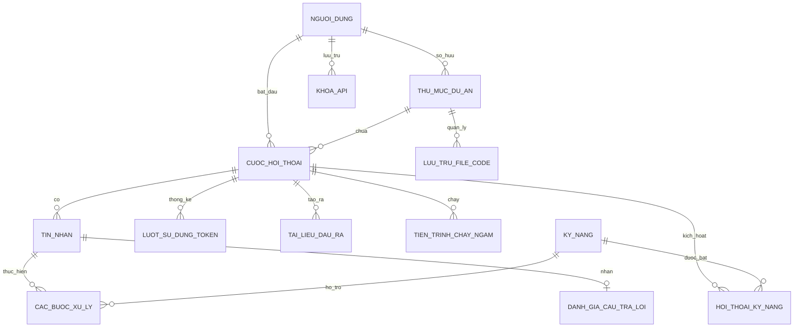

# Thiết Kế Cơ Sở Dữ Liệu Cho Trợ Lý AI Rexi (Bản Đầy Đủ & Tích Hợp Kỹ Năng)

Chào bạn! Đây là bản sao tài liệu thiết kế cơ sở dữ liệu được đặt riêng trong thư mục dự án `D:\AI REXI`.

---

## 1. Sơ đồ các mối quan hệ (Sơ đồ ER)

---

## 2. Chi Tiết Các Bảng & Trường Dữ Liệu

### Bảng 1: `nguoi_dung` (Quản lý tài khoản)
| Tên trường (Cột) | Kiểu dữ liệu | Ràng buộc | Mô tả chi tiết |
| :--- | :--- | :--- | :--- |
| `ma_nguoi_dung` | UUID | Khóa chính | ID định danh duy nhất của mỗi người |
| `email` | VARCHAR(255) | Duy nhất, Không để trống | Địa chỉ email đăng nhập |
| `mat_khau_ma_hoa` | VARCHAR(255) | Không để trống | Mật khẩu đã được hash bảo mật |
| `ten_day_du` | VARCHAR(100) | | Tên thật hoặc biệt danh hiển thị |
| `anh_dai_dien` | TEXT | | Đường dẫn tới ảnh đại diện |
| `cai_dat_ca_nhan` | JSONB | | Lưu giao diện (sáng/tối), ngôn ngữ ưa thích... |
| `ngay_tao` | TIMESTAMP | Mặc định là hiện tại | Thời điểm đăng ký tài khoản |
| `ngay_cap_nhat` | TIMESTAMP | Mặc định là hiện tại | Lần cuối cùng thay đổi thông tin |

---

### Bảng 2: `thu_muc_du_an` (Thư mục code/Workspace)
| Tên trường (Cột) | Kiểu dữ liệu | Ràng buộc | Mô tả chi tiết |
| :--- | :--- | :--- | :--- |
| `ma_thu_muc` | UUID | Khóa chính | ID định danh của thư mục dự án |
| `ma_nguoi_dung` | UUID | Khóa ngoại -> `nguoi_dung` | Thuộc sở hữu của ai |
| `ten_thu_muc` | VARCHAR(255) | Không để trống | Tên dự án (Ví dụ: "QuanLyNhanVien") |
| `duong_dan_may_tinh` | TEXT | Không để trống | Đường dẫn tuyệt đối (Ví dụ: `D:/Projects/...`) |
| `link_git` | TEXT | | Link repository GitHub/GitLab (nếu có) |
| `ngay_tao` | TIMESTAMP | Mặc định là hiện tại | Thời điểm thêm thư mục này vào app |

---

### Bảng 3: `cuoc_hoi_thoai` (Các phiên chat)
| Tên trường (Cột) | Kiểu dữ liệu | Ràng buộc | Mô tả chi tiết |
| :--- | :--- | :--- | :--- |
| `ma_hoi_thoai` | UUID | Khóa chính | ID định danh cuộc trò chuyện |
| `ma_nguoi_dung` | UUID | Khóa ngoại -> `nguoi_dung` | Ai là người tạo cuộc chat này |
| `ma_thu_muc` | UUID | Khóa ngoại -> `thu_muc_du_an` | Cuộc chat này đang làm việc ở dự án nào |
| `tieu_de` | VARCHAR(255) | Mặc định 'Trò chuyện mới' | Tiêu đề tóm tắt nội dung chat |
| `ten_mo_hinh_ai` | VARCHAR(100) | Không để trống | Tên mô hình sử dụng (như `gemini-3.5-flash`) |
| `trang_thai` | VARCHAR(50) | Mặc định 'dang_mo' | Trạng thái cuộc chat (`dang_mo`, `da_dong`, `da_xoa`) |
| `ngay_tao` | TIMESTAMP | Mặc định là hiện tại | Thời điểm bắt đầu chat |
| `ngay_cap_nhat` | TIMESTAMP | Mặc định là hiện tại | Lần cuối cùng có tin nhắn mới |

---

### Bảng 4: `tin_nhan` (Lịch sử chat chi tiết)
| Tên trường (Cột) | Kiểu dữ liệu | Ràng buộc | Mô tả chi tiết |
| :--- | :--- | :--- | :--- |
| `ma_tin_nhan` | UUID | Khóa chính | ID định danh tin nhắn |
| `ma_hoi_thoai` | UUID | Khóa ngoại -> `cuoc_hoi_thoai` | Thuộc cuộc chat nào |
| `vai_tro` | VARCHAR(50) | Không để trống | Ai gửi tin (`nguoi_dung`, `tro_ly_ai`, `he_thong`) |
| `noi_dung` | TEXT | Không để trống | Nội dung tin nhắn dạng chữ |
| `ngay_gui` | TIMESTAMP | Mặc định là hiện tại | Thời điểm tin nhắn được gửi |

---

### Bảng 5: `cac_buoc_xu_ly` (Quá trình suy nghĩ & hành động của AI)
| Tên trường (Cột) | Kiểu dữ liệu | Ràng buộc | Mô tả chi tiết |
| :--- | :--- | :--- | :--- |
| `ma_buoc` | UUID | Khóa chính | ID định danh bước xử lý |
| `ma_tin_nhan` | UUID | Khóa ngoại -> `tin_nhan` | Phục vụ cho câu trả lời nào |
| `ma_ky_nang` | UUID | Khóa ngoại -> `ky_nang` (Cho phép NULL) | Bước này có sử dụng Kỹ năng/Skill nào không |
| `so_thu_tu_buoc` | INT | Không để trống | Bước số mấy (1, 2, 3...) |
| `suy_nghi_noi_bo` | TEXT | | Đoạn tự thoại/phân tích của AI trước khi hành động |
| `ten_cong_cu` | VARCHAR(100) | | Công cụ AI đã dùng (ví dụ: `sua_file`, `doc_thu_muc`) |
| `tham_so_truyen_vao` | JSONB | | Dữ liệu truyền vào cho công cụ |
| `ket_qua_cong_cu` | TEXT | | Kết quả công cụ trả về |
| `thoi_gian_chay_ms` | INT | | Thời gian thực thi tính bằng mili-giây |
| `ngay_tao` | TIMESTAMP | Mặc định là hiện tại | Thời điểm thực hiện bước này |

---

### Bảng 6: `tai_lieu_dau_ra` (Quản lý các File kết quả/Artifacts)
| Tên trường (Cột) | Kiểu dữ liệu | Ràng buộc | Mô tả chi tiết |
| :--- | :--- | :--- | :--- |
| `ma_tai_lieu` | UUID | Khóa chính | ID định danh tài liệu |
| `ma_hoi_thoai` | UUID | Khóa ngoại -> `cuoc_hoi_thoai` | Được tạo ra trong cuộc chat nào |
| `ten_file` | VARCHAR(255) | Không để trống | Tên file (ví dụ: `ke_hoach_trien_khai.md`) |
| `duong_dan_file` | TEXT | Không để trống | Nơi lưu trữ file trên máy hoặc server |
| `tom_tat_noi_dung` | TEXT | | Tóm tắt nhanh nội dung tài liệu |
| `phien_ban` | INT | Mặc định là 1 | Phiên bản của tài liệu (tăng lên mỗi lần sửa) |
| `ngay_tao` | TIMESTAMP | Mặc định là hiện tại | Thời điểm tạo |
| `ngay_cap_nhat` | TIMESTAMP | Mặc định là hiện tại | Thời điểm sửa đổi gần nhất |

---

### Bảng 7: `tien_trinh_chay_ngam` (Các tiến trình terminal chạy nền)
| Tên trường (Cột) | Kiểu dữ liệu | Ràng buộc | Mô tả chi tiết |
| :--- | :--- | :--- | :--- |
| `ma_tien_trinh` | UUID | Khóa chính | ID định danh tiến trình |
| `ma_hoi_thoai` | UUID | Khóa ngoại -> `cuoc_hoi_thoai` | Thuộc cuộc chat nào |
| `cau_lenh` | TEXT | Không để trống | Câu lệnh hệ điều hành đã chạy (ví dụ: `npm run dev`) |
| `trang_thai` | VARCHAR(50) | Mặc định 'dang_chay' | Trạng thái (`dang_chay`, `hoan_thanh`, `loi`, `bi_huy`) |
| `id_tien_trinh_os` | INT | | Process ID (PID) do hệ điều hành cấp |
| `duong_dan_log` | TEXT | | Nơi lưu trữ file ghi lại đầu ra của câu lệnh (output log) |
| `ngay_bat_dau` | TIMESTAMP | Mặc định là hiện tại | Thời điểm bắt đầu chạy lệnh |
| `ngay_ket_thuc` | TIMESTAMP | | Thời điểm lệnh dừng hoặc chạy xong |

---

### Bảng 8: `khoa_api` (Quản lý API Key người dùng cung cấp)
| Tên trường (Cột) | Kiểu dữ liệu | Ràng buộc | Mô tả chi tiết |
| :--- | :--- | :--- | :--- |
| `ma_khoa` | UUID | Khóa chính | ID định danh của khóa |
| `ma_nguoi_dung` | UUID | Khóa ngoại -> `nguoi_dung` | Thuộc về tài khoản nào |
| `ten_nha_cung_cap` | VARCHAR(100) | Không để trống | Tên nhà cung cấp (Gemini, OpenAI, Anthropic...) |
| `gia_tri_khoa` | TEXT | Không để trống | Giá trị key (nên được mã hóa trước khi lưu) |
| `ngay_tao` | TIMESTAMP | Mặc định là hiện tại | Ngày cấu hình |

---

### Bảng 9: `danh_gia_cau_tra_loi` (Phản hồi/Feedback tin nhắn)
| Tên trường (Cột) | Kiểu dữ liệu | Ràng buộc | Mô tả chi tiết |
| :--- | :--- | :--- | :--- |
| `ma_danh_gia` | UUID | Khóa chính | ID định danh đánh giá |
| `ma_tin_nhan` | UUID | Khóa ngoại -> `tin_nhan` (Duy nhất) | Thuộc về tin nhắn nào |
| `loai_danh_gia` | VARCHAR(20) | Không để trống | Nhận `thich` (Like) hoặc `khong_thich` (Dislike) |
| `chi_tiet_gop_y` | TEXT | | Bình luận hoặc góp ý của người dùng |
| `ngay_tao` | TIMESTAMP | Mặc định là hiện tại | Ngày gửi feedback |

---

### Bảng 10: `luot_su_dung_token` (Thống kê & Giới hạn sử dụng)
| Tên trường (Cột) | Kiểu dữ liệu | Ràng buộc | Mô tả chi tiết |
| :--- | :--- | :--- | :--- |
| `ma_thong_ke` | UUID | Khóa chính | ID lượt thống kê |
| `ma_hoi_thoai` | UUID | Khóa ngoại -> `cuoc_hoi_thoai` | Thuộc cuộc hội thoại nào |
| `so_token_gui` | INT | Mặc định 0 | Số lượng token đầu vào gửi lên AI |
| `so_token_nhan` | INT | Mặc định 0 | Số lượng token AI phản hồi về |
| `chi_phi_uoc_tinh` | DECIMAL(10, 6) | Mặc định 0.0 | Chi phí dịch vụ ước lượng theo USD |
| `ngay_ghi_nhan` | TIMESTAMP | Mặc định là hiện tại | Thời điểm ghi log sử dụng |

---

### Bảng 11: `luu_tru_file_code` (Bộ nhớ đệm thông tin file trong dự án)
| Tên trường (Cột) | Kiểu dữ liệu | Ràng buộc | Mô tả chi tiết |
| :--- | :--- | :--- | :--- |
| `ma_file` | UUID | Khóa chính | ID định danh file trong cơ sở dữ liệu |
| `ma_thu_muc` | UUID | Khóa ngoại -> `thu_muc_du_an` | Thuộc thư mục dự án nào |
| `ten_file` | VARCHAR(255) | Không để trống | Tên file vật lý (ví dụ: `index.js`) |
| `duong_dan_tuong_doi` | TEXT | Không để trống | Đường dẫn tính từ gốc dự án (ví dụ: `src/index.js`) |
| `ma_hash_noi_dung` | VARCHAR(64) | | Mã băm MD5/SHA256 để kiểm tra file có bị sửa đổi không |
| `kich_thuoc_byte` | INT | | Kích thước file tính theo byte |
| `ngay_cap_nhat` | TIMESTAMP | Mặc định là hiện tại | Lần cuối quét và cập nhật thông tin file |

---

### Bảng 12: `ky_nang` (Định nghĩa các Kỹ năng/Skills của Agent)
| Tên trường (Cột) | Kiểu dữ liệu | Ràng buộc | Mô tả chi tiết |
| :--- | :--- | :--- | :--- |
| `ma_ky_nang` | UUID | Khóa chính | ID định danh kỹ năng |
| `ten_ky_nang` | VARCHAR(100) | Duy nhất, Không để trống | Tên viết thường liền nhau (Ví dụ: `ponytail`) |
| `tieu_de` | VARCHAR(150) | Không để trống | Tên hiển thị thân thiện (Ví dụ: "Chế độ tối giản") |
| `mo_ta` | TEXT | | Giải thích chức năng của kỹ năng này |
| `duong_dan_tep_tin` | TEXT | | Đường dẫn đến file hướng dẫn/cấu hình (như `SKILL.md`) |
| `trang_thai` | VARCHAR(50) | Mặc định 'kich_hoat' | Trạng thái (`kich_hoat`, `tam_dung`) |
| `ngay_tao` | TIMESTAMP | Mặc định là hiện tại | Ngày khai báo kỹ năng lên hệ thống |

---

### Bảng 13: `hoi_thoai_ky_nang` (Bảng liên kết bật/tắt kỹ năng trong phòng chat)
| Tên trường (Cột) | Kiểu dữ liệu | Ràng buộc | Mô tả chi tiết |
| :--- | :--- | :--- | :--- |
| `ma_hoi_thoai` | UUID | Khóa ngoại -> `cuoc_hoi_thoai` | Áp dụng cho phòng chat này |
| `ma_ky_nang` | UUID | Khóa ngoại -> `ky_nang` | Kỹ năng được kích hoạt |
| **Ràng buộc** | PRIMARY KEY (`ma_hoi_thoai`, `ma_ky_nang`) | | Mỗi kỹ năng chỉ kích hoạt 1 lần trong 1 cuộc chat |
